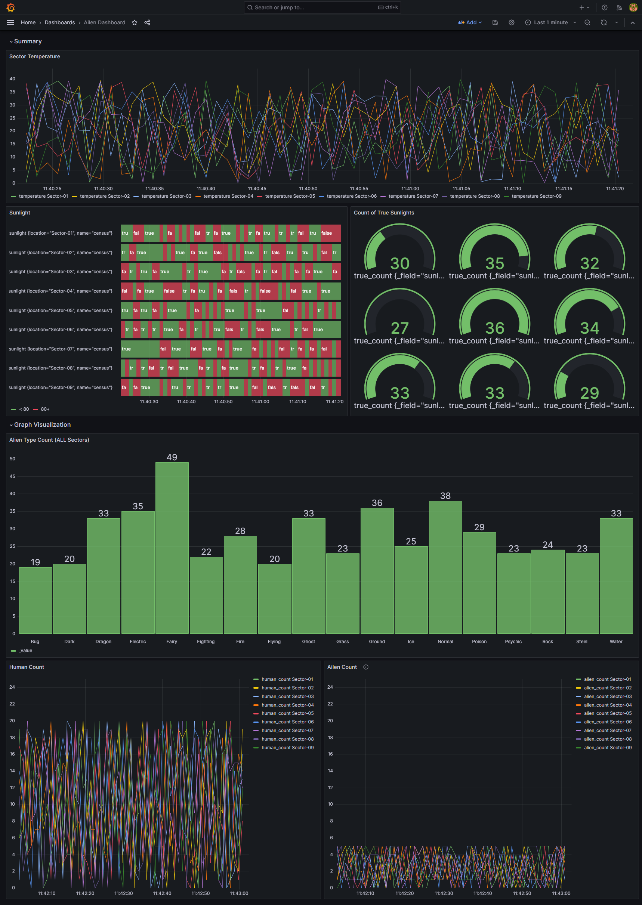

## Background

In the realm of artificial intelligence, the process of inference involves deploying trained models to make predictions on new data. As these inferences are made, especially in real-time scenarios, it becomes imperative to monitor the results for accuracy, anomalies, and performance. Monitoring in real-time ensures that the AI system is functioning optimally and provides actionable insights. Visualization complements monitoring by offering a graphical representation of the AI's performance metrics, making it easier for stakeholders to understand and act upon.

However, setting up such a system in a cloud environment directly can be resource-intensive and might not be ideal during the initial development and testing phases. This is where the concept of a localized system comes into play. By creating a local environment that mirrors the cloud, developers can test, monitor, and visualize AI inferences without the overheads of a full-scale cloud deployment.

Furthermore, with the rise of container technologies like Docker, it's now possible to package the AI module, monitoring tools, and visualization dashboards into isolated containers. This ensures consistency, scalability, and portability across different stages of development. Orchestration, using systems like Kubernetes, automates the deployment, scaling, and management of these containers, simulating a cloud-like environment on a local setup.

## Problem Statement

We need a solution that allows for real-time AI inference monitoring and visualization within a local, containerized environment, ensuring seamless scalability and transition to cloud deployments.

## Problem

The challenge lies in developing a localized, containerized solution that:

1. **Runs AI Inference**: Incorporates a standalone AI module adept at processing data and generating time-series results.
2. **Stores and Retrieves Results**: An efficient mechanism to store time-series AI outputs and ensure swift data retrieval.
3. **Visualizes Data**: A dynamic visualization tool that offers real-time insights into the AI's performance, aiding stakeholders in decision-making.
4. **Monitors System Health**: A robust monitoring system that provides a holistic view of all components, from AI processing to data storage.
5. **Orchestrates Workloads**: Utilizes orchestration tools to manage, scale, and automate tasks, ensuring the local environment closely simulates cloud deployments.

## Objective

To design and implement a solution that seamlessly integrates an AI module, efficient data storage mechanisms, dynamic visualization tools, and comprehensive monitoring systems. This solution should be containerized and orchestrated, allowing for easy deployment, scaling, and management, all while simulating a cloud-like environment locally.

## Local Simulation

The solution should be deployable on local machines using containerization tools like Docker and orchestrated using platforms like Docker-Compose/Kubernetes. This setup aims to:

- Facilitate rapid prototyping and testing in a controlled environment.
- Simulate real-world cloud scenarios and workloads.
- Offer efficient debugging and troubleshooting capabilities.

## Constraints

- The AI module should remain modular and independent for straightforward updates and modifications.
- Data persistence must be ensured, even in the event of container failures.
- Real-time visualization capabilities should allow for specific time interval analyses.
- Comprehensive monitoring should cover all components, offering timely alerts for any anomalies.

## Architecture

This repository presents our proposed architecture designed to streamline monitoring and orchestration processes for containerized applications. The architecture is divided into four primary layers: Visualization, Databases, Modules, and Orchestration. It integrates powerful tools like Grafana, Prometheus, and InfluxDB for efficient data visualization and storage. On the module front, it incorporates cAdvisor, Node Exporter, and specialized AI inference modules for comprehensive data collection and processing. For orchestration, we propose a flexible approach, allowing users to choose between Docker Compose and Kubernetes, all running on the robust Ubuntu operating system. This architecture ensures efficient data flow, from raw metrics collection to insightful visualization, ensuring optimal performance and observability of your applications.


## TODOs

- [X] Local Inference Script Update
- [X] Live Inference Script Update - Fix Output stream Dimensions
- [X] Influx DB setup
- [X] Influx Python Local Inserter
- [X] Live Count Update on Live RTSP
- [ ] Live Inference Pictures with Data Insert
- [ ] C++ Algorithm
- [ ] GPU Device Monitoring
- [ ] Live Inference Speed / Accuracies Monitoring
- [ ] Mojo vs Python Test
- [ ] Kubernetes Setup
- [ ] Alert Manager Setup
- [ ] Live Dashboard Update
- [ ] Grafana Live Streams (RTSP)
- [ ] Cloud Deployment - Integration with Azure and AWS
- [ ] ReadMe Documentation - Grafana/Influx/cAdvisor/NodeExporter/AlertManager

## Learning Goals
- Docker
- Grafana
- Prometheus
- Kubernetes

## Setup

### Base Image Building

Currently there is only a single Base Image. First, build Base image:

```terminal
docker build -f ./build/base-env.dockerfile -t ai-stack-lite-base-1 .
```

After building the base image, build Run image:

```terminal
docker build -f run-env.dockerfile -t ai-stack-lite-run-1 .
```

In order to simulate real world scenario, a Camera Stream is needed, in this case, [MediaMTX](https://github.com/bluenviron/mediamtx) is used to assist. Build MediaMTX image:

```terminal
docker build -f ./mediamtx/emulator-env.dockerfile -t mediamtx-env-1 .
```

### Modular Token Key

Start by creating env files in the build directory:

```terminal
/build/build.env
```

Ensure the following variables are available in **build.env**:

```terminal
MOJO_KEY=<Your Key>
```

### Execution - Docker/Docker-Compose

For debugging purpose, you can run only Single Module interactively:

```terminal
docker run -it --gpus all -t ai-stack-lite-base-1:latest
```

Using Docker-Compose:

```terminal
docker-compose -f docker-compose.yml up
```

### YoloV8 Class Names

Following is provided from [coco.names](https://github.com/pjreddie/darknet/blob/master/data/coco.names):

```makefile
0-4: person, bicycle, car, motorbike, aeroplane
5-9: bus, train, truck, boat, traffic light
10-14: fire hydrant, stop sign, parking meter, bench, bird
15-19: cat, dog, horse, sheep, cow
20-24: elephant, bear, zebra, giraffe, backpack
25-29: umbrella, handbag, tie, suitcase, frisbee
30-34: skis, snowboard, sports ball, kite, baseball bat
35-39: baseball glove, skateboard, surfboard, tennis racket, bottle
40-44: wine glass, cup, fork, knife, spoon
45-49: bowl, banana, apple, sandwich, orange
50-54: broccoli, carrot, hot dog, pizza, donut
55-59: cake, chair, sofa, pottedplant, bed
60-64: diningtable, toilet, tvmonitor, laptop, mouse
65-69: remote, keyboard, cell phone, microwave, oven
70-74: toaster, sink, refrigerator, book, clock
75-79: vase, scissors, teddy bear, hair drier, toothbrush
```

Please use the right ID under "CLASS_IDS", order is displayed accordingly.

#### Sample AI Module - Python

Following shows an example configuration for a Python Module

```docker-compose
python-module-1:
image: ai-stack-lite-run-1:latest
ports:
    - 8001:5000/tcp
environment:
    - RUN_TYPE=python
    - RUN_SCRIPT_PATH=apps/python/live-gpu-inference-traffic-mt.py
    - MODEL_PATH=yolov8x.pt
    - CAMERA_LOCATION=Townhall
    - RTSP_INPUT=rtsp://emulator-module:8554/sample-1
    - RTSP_OUTPUT=rtsp://emulator-module:8554/live-1
    - CLASS_IDS=0,1,16,2,3,5,7
    - INTEREST_LINE_COORDINATES=960,0
    - TRAFFIC_LINE_COORDINATES=960,0
    - SCALE_PERCENT=50
    - DEFAULT_LINE_SIZE=2
    - DEFAULT_FONT_SCALE=1
    - DEFAULT_OFFSET=2
# Deploy on GPU
deploy:
    resources:
    reservations:
        devices:
        - driver: nvidia
            count: 1
            capabilities: [gpu]
```

#### Sample AI Module - C++

TBA

### Execution - Kubernetes ( :exclamation: Issues: After Kubectl installation, WIFI is removed on Host)

Ensure to have [minikube](https://minikube.sigs.k8s.io/docs/start/) installed:

```terminal
curl -LO https://storage.googleapis.com/minikube/releases/latest/minikube-linux-amd64
sudo install minikube-linux-amd64 /usr/local/bin/minikube
minikube start
```

Install Kubectl via - [Kubectl Link](https://kubernetes.io/docs/tasks/tools/install-kubectl-linux/)
```terminal
curl -LO "https://dl.k8s.io/release/$(curl -L -s https://dl.k8s.io/release/stable.txt)/bin/linux/amd64/kubectl"
sudo install -o root -g root -m 0755 kubectl /usr/local/bin/kubectl
kubectl version --client
```

## Visualization and AI Inference

The emulator module contains 5 main streams, 2 replays sample footage (MOT1608raw.mp4 and MOT1602raw.mp4) recursively, and 3 live stream path opening wait for publishing. This section mainly describes the visualization dashboard and AI Inference.

### Dummy Data Visulization

Output Grafana Visualization (Dummy Data):



### Traffic - Pedestrian and Vehicle Detection

The Side by Side outcome is shown as following (**Left Stream Emulator Video**, **Right Inference Video**):


Visualization Dashboard is as following:
- TBA


### Traffic - Vehicle Detection

The Side by Side outcome is shown as following (**Left Stream Emulator Video**, **Right Inference Video**):


Visualization Dashboard is as following:
- TBA

### Pedestrian - Person Detection

The Side by Side outcome is shown as following (**Left Stream Emulator Video**, **Right Inference Video**):


Visualization Dashboard is as following:
- TBA

### Pedestrian - Key Point Detection

The python modules individually takes in the given $RTSP_INPUT and publish to $RTSP_OUTPUT based on given configurations:

As an example, you will see a similar input and output to the following:
Raw Video             |  Inferenced Video
:--------------------:|:--------------------:
  |  

Visualization Dashboard is as following:
- TBA

### Live Harbour Bridge

As an interesting experiment, let's use a public live camera stream from Sydney:
- [Sydney Harbor Bridge Live Stream Link](http://220.233.144.165:8888/mjpg/video.mjpg)

The Side by Side outcome is shown as following (**Left Stream Emulator Video**, **Right Inference Video**):


## Monitoring

The uses of off-the-shelf modules (Grafana, Prometheus, node-exporter, cadvisor) and setup to monitor Host and docker environments:

Node Exporter         |
:--------------------:|


cAdvisor              |
:--------------------:|


## Performance Comparison

Input Stream Specification:
- Frame Size
- FPS

Metrics | Python | C++ | Modular
:------:|:------:|:---:|:------:|
RAM|
CPU|
GPU|


## Cloud Deployments

TBD

## Reference Sites

Following the links:

- [Enhancing AI Development with Mojo: Code Examples and Best Practices](https://artificialcorner.com/enhancing-ai-development-with-mojo-code-examples-and-best-practices-6341c3e66e15)
- [Get started with Mojo🔥](https://docs.modular.com/mojo/manual/get-started/index.html)
- [How to install Mojo🔥locally using Docker](https://medium.com/@1ce.mironov/how-to-install-mojo-locally-using-docker-5346bc23a9fe)
- [Object-tracking-and-counting-using-YOLOV8](https://github.com/mohamedamine99/Object-tracking-and-counting-using-YOLOV8)
- [grafana-livecamera-rtsp-webrtc](https://github.com/cxnturi0n/grafana-livecamera-rtsp-webrtc/tree/main)
- [go2rtc](https://github.com/AlexxIT/go2rtc)
- [Yolo V8 - Vehicles Detecting \ Counting](https://www.kaggle.com/code/paulojunqueira/yolo-v8-vehicles-detecting-counting)
- [Tracking and counting of object using YOLO v8](https://github.com/sankalpvarshney/Track-And-Count-Object-using-YOLO)
- [Open CV RTSP camera buffer lag](https://stackoverflow.com/questions/60816436/open-cv-rtsp-camera-buffer-lag)
- [opencv read error:[h264 @ 0x8f915e0] error while decoding MB 53 20, bytestream -7](https://stackoverflow.com/questions/49233433/opencv-read-errorh264-0x8f915e0-error-while-decoding-mb-53-20-bytestream)
- [Object Detection using YOLOv5 OpenCV DNN in C++ and Python](https://learnopencv.com/object-detection-using-yolov5-and-opencv-dnn-in-c-and-python/)
- [How to install OpenCV 4.5.2 with CUDA 11.2 and CUDNN 8.2 in Ubuntu 20.04](https://gist.github.com/raulqf/f42c718a658cddc16f9df07ecc627be7)


